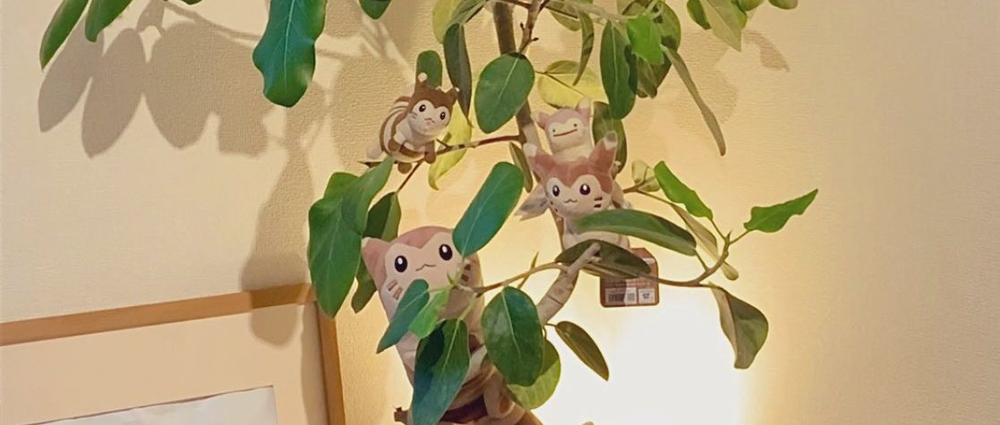

# yoshina-yt 🍃

#### Twitch song request via custom reward's bot for web player with support of YouTube and Spotify!

  

# Introduction 📕

It is _a massive_ rewrite of original forked project [yoshina](https://github.com/shysecre/yoshina), which supported only Spotify tracks and played them via Spotify desktop app.  
This version supports both YouTube and Spotify tracks and plays them via web player. (Hosted on your local machine)  
It also has `/widget` endpoint that you can use to display the current song on your stream.  

# Description 📝

Simply putting, it's a bot that listens to twitch chat and reacts to custom rewards.  
When someone redeems the reward, it will add the track to the player queue.  
Player will play tracks in order they were added.  
You as streamer can skip tracks, pause, resume, stop player from browser  

# Installation & Setup 🛠️

## Requirements

- Git - [Download](https://git-scm.com/downloads)
- Node v22 or higher. - [Download](https://nodejs.org/en/download/)
- Spotify and Twitch developer accounts. (Don't worry, it's free and easy to create)

## Steps

1. Clone repo using `git clone https://github.com/richardscull/yoshina-yt` in terminal.
2. Create `.env` file in root folder and fill it according to example file `.env.example`.
   - For twitch client & secret thing, visit: [dashboard](https://dev.twitch.tv/console/apps) and create new application.
     - Full name, OAuth Redirect URLs (http://localhost:8000/twitch-auth), Category (Chat Bot). Copy client ID and secret to `.env` file.
   - For Spotify client & secret thing, visit: [dashboard](https://developer.spotify.com/dashboard) and create new application.
     - Full name, Description, Redirect URIs (http://localhost:8000/spotify-auth). Copy client ID and secret to `.env` file.
3. Run `Start.bat` or `Start.sh` file depending on your OS to install dependencies and start the server.
4. Follow the instructions in the terminal to authenticate with Spotify and Twitch.
5. Open browser and go to `http://localhost:8000` to see player interface.

# Special Thanks ❤️

- [shysecre - For original project and idea](https://github.com/shysecre)
